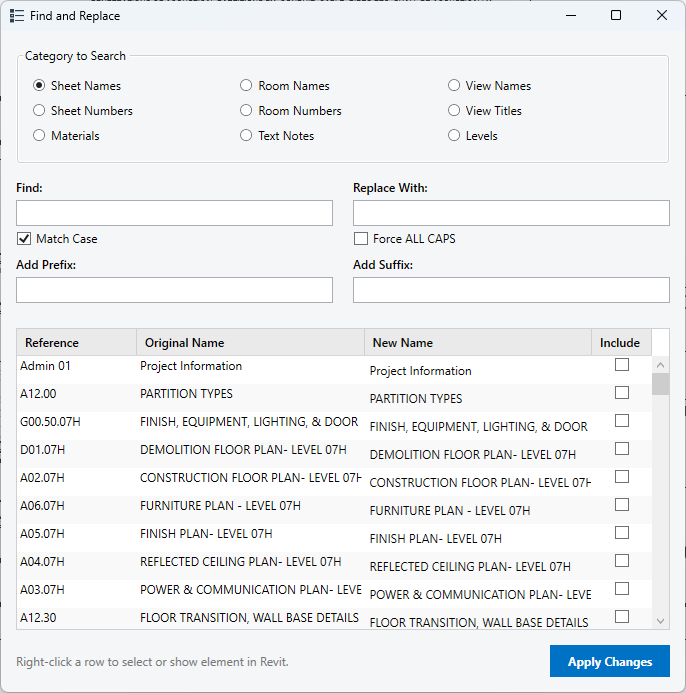
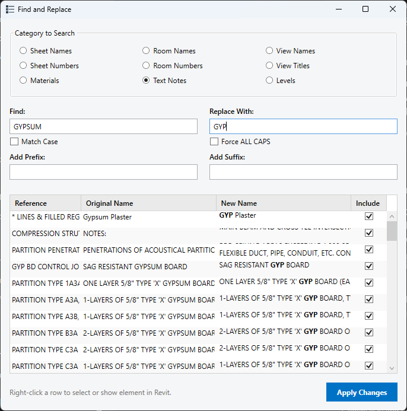
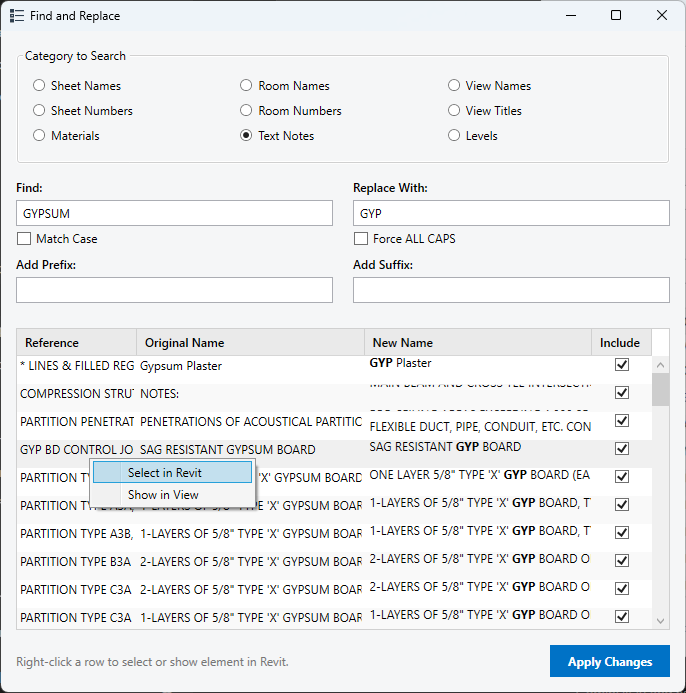

# pyRevit Find and Replace Tool

An interactive, modeless pyRevit extension designed to search for and replace text across nearly any element category in your Revit model. This tool utilizes a custom WPF/XAML interface powered by a thread-safe Python execution environment to interact with the Revit database seamlessly without locking your application.

---

## Features

* **Multi-Category Support**: Target and replace text in Sheet Names, Sheet Numbers, Room Names, View Titles, Materials, Text Notes, and more.
* **Modeless Execution**: The interface floats natively on top of Revit, utilizing an `IExternalEventHandler` ("Universal Handler") to safely route database transactions back to Revit's main thread.
* **Live Filtering & Rich Text Previews**: The list dynamically filters itself as you type into the "Find" field. Changes in the list are previewed in bold text dynamically via WPF `Run` objects before you commit them.
* **Match Case Toggle**: Includes a checkbox to force case-sensitive searches, powered securely by Python's regex (`re`) module.
* **Contextual Navigation**: Right-click any row in the DataGrid to instantly select that object or navigate to it (`ShowElements`) within your active Revit view. 

---

## Installation 

You can install this extension directly from this GitHub repository using pyRevit's built-in tools.

1. Open Revit and navigate to the `pyRevit` tab on the ribbon.
2. Click the `pyRevit` drop-down menu (small triangle icon next to "pyRevit") and select `Extensions`.
3. In the Extension Manager window, paste this repository's Git URL into the GIT URL field:
   `https://github.com/burnished-edge/pyRevit-FindAndReplace.git`
4. Provide a name for the tool if prompted, then click `Add and install`. 
5. Once the installation completes, close the Extension Manager and click `Reload` in the pyRevit ribbon menu. The new ribbon button panel will generate on your screen.

---

## Keeping the Tool Updated

Because the extension is linked directly to GitHub via pyRevit, applying future updates is effortless. Whenever a new version or bug fix is pushed to this repository:

1. Open the `pyRevit Extension Manager`.
2. Locate the Find and Replace Tool in your installed list.
3. Click `Update`. pyRevit will automatically pull the latest source code from GitHub and apply the changes. 
4. Reload pyRevit to see the updates take effect.

---

## How To Use

1. Click the `Find & Replace` button on your ribbon panel to launch the floating dashboard.
2. Select your target category using the radio buttons at the top of the window (e.g., Room Names, View Titles).
3. Type your search string into the **Find** field. The DataGrid will instantly filter the list of elements as you type.
4. Type your desired replacement string into the **Replace** field. The "New Name" column will dynamically preview the changes with bold text formatting.

5. *(Optional)* Check the **Match Case** box if you require strict capitalization matching.
6. *(Optional)* Right-click any row in the table to **Select** the element in the model or **Show** it in the active view. Note that attempting to "Show" non-physical elements (like Materials) will gracefully alert you that they do not exist in graphical views.

7. Click **Apply** to push the text replacements back into the Revit database.
